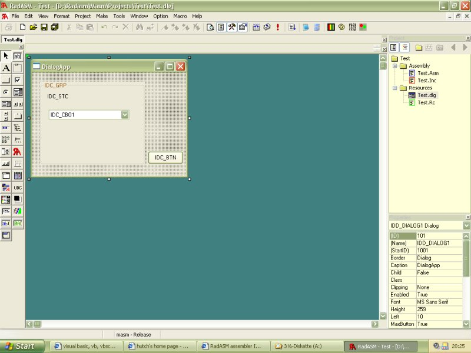

<div align="center">

## Did you know there is a visual assembler for windows ?


</div>

### Description

Make the next step and learn something new. Create assembler windows applications of just 1k size in less then 30 seonds. See screenshot.
 
### More Info
 


<span>             |<span>
---                |---
**Submitted On**   |
**By**             |[Ranma Saotome](https://github.com/Planet-Source-Code/PSCIndex/blob/master/ByAuthor/ranma-saotome.md)
**Level**          |Beginner
**User Rating**    |4.9 (34 globes from 7 users)
**Compatibility**  |VB 3\.0, VB 4\.0 \(16\-bit\), VB 4\.0 \(32\-bit\), VB 5\.0, VB 6\.0, VB Script, ASP \(Active Server Pages\) , VBA MS Access, VBA MS Excel
**Category**       |[Coding Standards](https://github.com/Planet-Source-Code/PSCIndex/blob/master/ByCategory/coding-standards__1-43.md)
**World**          |[Visual Basic](https://github.com/Planet-Source-Code/PSCIndex/blob/master/ByWorld/visual-basic.md)
**Archive File**   |[](https://github.com/Planet-Source-Code/ranma-saotome-did-you-know-there-is-a-visual-assembler-for-windows__1-47893/archive/master.zip)


### Source Code

```
I am a VB programmer myself and switched lately to c++ and assembly programming.
Yes assembly is really hard to learn but its worth it.
Well what do you need to start visual assembly for windows ?
First of all a compiler. You get the free microsoft MASM32 linker from Hutchs page:
http://www.movsd.com/ ---> MASM32 Download
Its just 3mb big! Welcome to assembly.
The next thing you download is the free 1mb
visual assembly editor. You combine them to 1 powerfull tool. No installation required. Just copy them to your harddrive.
You get the visual assembly here:
http://radasm.visualassembler.com/
Both downloads contain loads and loads of tutorials and snippets and examples source to get you started in windows programming. And once you ve seen a richtexteditor of just 10kb size you will love it.
Please dont flame me for posting this here, i still love vb buts sometimes its just too limited.
Update: I created a fully webtutorial "From VB to Assembler" using Radasm with tons of scrennshots and samples for download.
The site is here: http://members.a1.net/ranmasaotome/main.html
```

